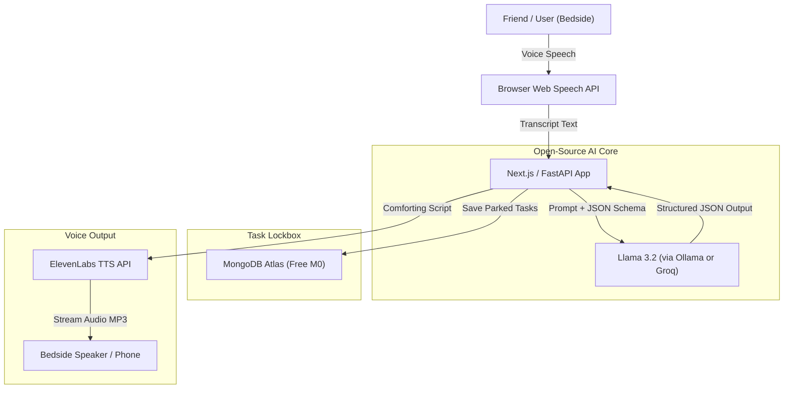

# SlumberSafe: Bedside Debrief & Doomscroll Deterrent
**Project Blueprint & 24-Hour Implementation Roadmap**  
*Hacktoberfest 2026 DEV Challenge #1: "Build for a Friend"*

---

## 1. Project Overview & Challenge Alignment

### 1.1 The Concept
**SlumberSafe** is a private, voice-first bedtime companion designed to break the late-night anxiety-and-doomscrolling cycle. Instead of looking at blue light or letting unfinished tasks loop in their head, the user has a quick spoken decompression session in bed. The app validates their feelings, automatically extracts and "locks away" actionable tasks for the morning, and transitions directly into a calming, low-stimulation audio story or ambient sounds.

### 1.2 Alignment with Hacktoberfest 2026 Rules
* **Theme ("Build for a Friend"):** Built for a specific friend who suffers from bedtime work anxiety and ends up doomscrolling until 2:00 AM.
* **Core Technology:** Powered by pre-trained open-weight models (**Llama 3.2 3B** locally via Ollama or via Groq's open model endpoint).
* **The "Why Open-Source AI" Mandate:** 
  * **Data Sovereignty:** Late-night vulnerable thoughts, anxieties, and private schedules are processed with open weights without being logged by commercial cloud giants.
  * **Zero Token Anxiety:** The user can use it every single night without paying subscription fees or running up closed API token bills.
* **Target Partner Categories:**
  * **ElevenLabs:** Soft, whispered bedtime voice generation.
  * **MongoDB Atlas:** Free M0 cluster storing encrypted "parked tasks" for morning retrieval.
  * **Sentry:** Tracking agent pipeline latency and tool-call errors.

---

## 2. Final Feature Specifications (MVP Scope)

```
┌─────────────────────────────────────────────────────────────┐
│                      SLUMBERSAFE MVP                        │
├─────────────────────────┬───────────────────────────────────┤
│ 1. Doomscroll           │ Late-night popup/banner alerting  │
│    Interceptor          │ the user to step away from feed.  │
├─────────────────────────┼───────────────────────────────────┤
│ 2. Bedside Voice        │ Dark-mode screen-free spoken      │
│    Debrief              │ decompression session.            │
├─────────────────────────┼───────────────────────────────────┤
│ 3. Task Lockbox         │ Extracts actionable to-dos and    │
│    (Morning Momentum)   │ parks them safely until 8:30 AM.  │
├─────────────────────────┼───────────────────────────────────┤
│ 4. Sleep Story          │ Generates a low-stimulation story │
│    Engine               │ on any user topic via ElevenLabs. │
└─────────────────────────┴───────────────────────────────────┘
```

### Feature 1: The Doomscroll Interceptor
* **User Experience:** When opening the app or navigating past 11:00 PM, a soothing amber/indigo alert banner appears:
  > *"It's 11:15 PM. You've been scrolling for 40 minutes. Your brain deserves rest. Put your phone face-down and start tonight's 3-minute wind-down."*
* **Call to Action:** One prominent button: **[Start Wind-Down]**.

### Feature 2: Screen-Free Bedside Voice Debrief (Hero Feature)
* **User Experience:** 
  1. The UI turns pure OLED Black (`#0a0a0c`) with a soft pulsing audio ring.
  2. The user taps once, sets the phone on their nightstand, and speaks aloud:
     > *"I'm stressed about the team meeting tomorrow. I didn't send the financial report to Mark, and I need to buy groceries before noon."*
  3. Browser speech recognition transcribes the audio locally in real time.

### Feature 3: The "Parked Tasks" Lockbox
* **Under the Hood:** An open-weight LLM processes the transcript with a strict JSON schema:
  * Identifies concrete action items (`"Send financial report to Mark"`, `"Buy groceries before noon"`).
  * Stores them in MongoDB Atlas under the user's private session with status `PARKED`.
* **Audio Feedback:** The voice responds soothingly:
  > *"I have locked away those 2 tasks for tomorrow morning. Your brain is officially off the clock tonight. Let tomorrow worry about tomorrow."*

### Feature 4: On-Demand Calming Sleep Story
* **User Experience:** The assistant asks:
  > *"Would you like a short sleep story? You can name any topic or setting, or just say 'goodnight'."*
* If the user says: *"A quiet rainy harbor in Maine"*, the LLM crafts a 100-word low-stimulation, slow descriptive passage.
* **ElevenLabs Integration:** Synthesized in a soft, low-pace whispered voice that eases the user into sleep.

### Feature 5: Morning Momentum View
* When opened after 7:00 AM, the app swaps from "Night Mode" to "Morning Mode".
* Displays a clean card:
  > *"Good morning! Here are the 2 tasks you parked last night: 1) Send financial report to Mark, 2) Buy groceries before noon."*

---

## 3. System Architecture & Tech Stack



### Stack Choices (100% Free, No Credit Card Required):
* **Frontend:** Next.js (App Router) + Tailwind CSS (configured for OLED Dark Mode `#0a0a0c`).
* **Speech Input (STT):** Browser Web Speech API (`webkitSpeechRecognition`) — requires zero setup and no API keys.
* **AI Engine (LLM):** 
  * **Option A (Local):** Ollama running `llama3.2:3b`.
  * **Option B (Fast Cloud):** Groq Cloud free tier calling `llama-3.3-70b-versatile`.
* **Voice Output (TTS):** ElevenLabs API (Free tier: 10,000 characters/month) using a soft voice ID like `Rachel` or `George`.
* **Database:** MongoDB Atlas (Free M0 cluster) using `@mongodb` or Mongoose.
* **Monitoring:** Sentry JavaScript SDK for tracking agent latency and errors.

---

## 4. System Prompts & Data Schema

### 4.1 System Prompt (Debrief & Task Separation)

```text
You are SlumberSafe, a soothing, empathetic bedtime decompression companion.
Your goal is to help a tired, anxious user empty their mind so they can fall asleep peacefully.

Input: The user's late-night spoken thoughts.

Instructions:
1. Empathize briefly in 1-2 calm, reassuring sentences. Reassure them that tomorrow will be fine and their work is done for tonight.
2. Extract any concrete, actionable tasks they mentioned so they do not have to keep them in memory.
3. Suggest a calming theme for tonight's sleep story.

Output must strictly match this JSON schema:
{
  "comforting_response": "string (calm, warm, max 40 words)",
  "parked_tasks": ["string"],
  "story_prompt_suggestion": "string"
}
```

### 4.2 System Prompt (Sleep Story Generator)

```text
You are a bedtime sleep storyteller. 
Given a topic, generate a 120-word peaceful, sensory-rich, low-tension scene.
Use gentle imagery (gentle rain, slow rustling leaves, soft moonlight, warmth).
Avoid high-stakes plot twists, danger, or sudden excitement.
End with a gentle invitation to close eyes and rest.
```

---

## 5. Step-by-Step 24-Hour Implementation Plan

```mermaid
gantt
    title SlumberSafe 24-Hour Hackathon Sprint
    dateFormat  HH
    axisFormat  %H:00
    section Setup & Scaffold
    Next.js + Tailwind + Dark UI           :00, 2h
    section Core Logic
    Open LLM Integration (Llama 3.2)       :02, 3h
    Web Speech STT & ElevenLabs TTS         :05, 3h
    MongoDB Atlas Task Lockbox             :08, 2h
    section Features & Polish
    Doomscroll Interceptor & Morning View  :10, 2h
    Testing & Error Handling (Sentry)      :12, 2h
    section Submission
    Record 90-sec Loom Video Demo          :14, 2h
    Write & Publish DEV.to Submission Post :16, 4h
```



### Phase 1: Setup & Scaffolding (Hours 0–2)
1. Initialize repository: `npx create-next-app@latest slumbersafe --tailwind --typescript`.
2. Configure pure dark palette (`bg-zinc-950`, text indigo/emerald accents).
3. Set up environment variables (`.env.local`):
   ```env
   ELEVENLABS_API_KEY=your_key
   ELEVENLABS_VOICE_ID=21m00Tcm4TlvDq8ikWAM
   MONGODB_URI=your_mongodb_atlas_uri
   GROQ_API_KEY=your_groq_key # or OLLAMA_URL=http://localhost:11434
   ```

### Phase 2: Open-Source AI Engine (Hours 2–5)
1. Create API route `/api/debrief` that receives the user's transcript.
2. Call Llama 3.2 with the structured JSON schema.
3. Verify that tasks are properly extracted and comforting text is returned.

### Phase 3: Voice In & Voice Out (Hours 5–8)
1. Implement a React hook `useSpeechToText` using `webkitSpeechRecognition`.
2. Create API route `/api/tts` that passes the comforting text to ElevenLabs and streams the MP3 audio back.
3. Hook audio playback so it plays immediately through the device speaker.

### Phase 4: Database & Morning Momentum (Hours 8–10)
1. Connect to MongoDB Atlas.
2. Save `{ userId, tasks, createdAt: new Date(), status: 'PARKED' }`.
3. Create a simple toggle or time check: if current time is daytime (or via a "View Morning" demo button), display the parked tasks with checkboxes.

### Phase 5: Interceptor & Polish (Hours 10–12)
1. Add the Late-Night Interceptor banner at the top of the interface.
2. Integrate `@sentry/nextjs` to capture performance traces.
3. Test the full loop end-to-end.

### Phase 6: Demo Video Recording (Hours 12–14)
1. Open [Loom](https://www.loom.com/) or OBS.
2. Keep the video under 90 seconds:
   * **0:00–0:20:** Show the Late-Night Interceptor ("My friend Sarah scrolls Reddit at 11:30 PM...").
   * **0:20–0:50:** Speak into the app, show real-time transcription and the ElevenLabs soft voice soothing the user.
   * **0:50–1:15:** Show the tasks safely parked and the generated bedtime story.
   * **1:15–1:30:** Switch to Morning Mode showing the recovered tasks and explain why open-source AI makes this 100% private.

### Phase 7: Writing the DEV.to Post (Hours 14–18)
* Writing quality is the #1 weighted scoring factor.
* Use the official template provided in Section 6 below.

---

## 6. Official DEV.to Post Submission Template

```markdown
---
title: SlumberSafe - The Private Bedside Debrief & Doomscroll Deterrent
published: true
tags: hf26challenge, opensource, ai, webdev
cover_image: https://your-clean-cover-image.png
---

## What I Built
SlumberSafe is an open-source, screen-free bedside companion built to break the late-night work anxiety and doomscrolling cycle for my friend Sarah. 

## The Story: Building for Sarah
Sarah is a startup designer whose mind races with unfinished to-dos every night at 11:00 PM. To escape the anxiety, she turns to Reddit and Instagram, doomscrolling until 2:00 AM. Off-the-shelf chatbots didn't help because they aren't voice-first, they store personal confessions on commercial servers, and they don't follow up on tasks.

## Why Open-Source AI?
SlumberSafe uses **Meta's Llama 3.2** at its core. Open-source AI was essential because:
1. **Intimate Privacy:** Sarah's late-night anxieties and personal schedules are processed locally/privately without being monetized or trained on by big tech.
2. **Zero Subscription Anxiety:** A sleep tool must run every single night without worrying about credit limits or recurring bills.

## How It Works
- **Doomscroll Interceptor:** Prompts Sarah to put the screen down past 11:00 PM.
- **Voice Debrief:** Captures spoken thoughts screen-free via the Web Speech API.
- **Task Separation Engine:** An open-weight model separates raw worries from concrete to-dos and parks them in MongoDB Atlas.
- **Soothing Sleep Narrator:** Powered by ElevenLabs, it tells a slow, tranquil story on any topic she chooses.
- **Morning Momentum:** Delivers the parked tasks the next morning so nothing is forgotten.

## Demo & Repository
- 🔗 **Live Demo:** [Deploy Link](https://your-demo.vercel.app)
- 🎥 **Video Walkthrough:** [Loom / YouTube Link](https://loom.com/...)
- 💻 **GitHub Repository:** [github.com/your-username/slumbersafe](https://github.com/...)

## Prize Categories
- Best Use of ElevenLabs
- Best Use of MongoDB Atlas
- Best Use of Sentry
